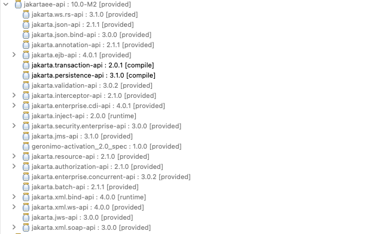

+++
title = "Architecture d'entreprise JEE"
weight = 50
+++

> [!ressource] Ressources
> - [07 - 01 - Persister des données en Java EE avec JPA et des EJB](https://youtu.be/7y2AQvZHkRs)
> - [07 - 02 - Persister des données en Java EE avec JPA et CDI](https://youtu.be/fTVAEWwv2V4)
> - [07 - 03 - Configurer JPA et CDI en Java EE](https://youtu.be/aDFrNwvqA90)

> [!ressource] Ressources
> - [https://github.com/Adrien-Courses/R605-TP-JPA-JEE](https://github.com/Adrien-Courses/R605-TP-JPA-JEE)

La vidéo 07-03 très intéressante car plus besoin de configurer l'accès à la base de données depuis persistance.xml mais directement depuis le serveur d'application (e.g. Tomcat), en soit ce que j'ai en entreprise

## Exemple d'architecture


## CDI
> CDI (Contexts and Dependency Injection) is a powerful dependency injection framework that is part of the Jakarta EE (formerly Java EE) platform. It allows for the injection of dependencies into managed beans and provides a way to manage the lifecycle of those beans. It also supports contextual lifecycle management and events, making it a key part of Java enterprise applications.

Avec CDI, nous n'avons plus besoin d'une méthode `main()` comme point d'entrée de l'application. Le conteneur CDI (comme celui fourni par un serveur d'applications Java EE) gère le cycle de vie de l'application. De plus, CDI gère la création et l'injection des objets, ce qui signifie que nous n'avons plus besoin d'utiliser `new()` pour instancier la plupart de nos objets.

### Sans CDI
```java
public static void main(String args[]) {
    ArticleRepository articleRepository = new ArticleRepository();
    ArticleService articleService = new ArticleService(articleRepository);
    RestControllerArticle rca = new RestControllerArticle(articleService);
}
```

### Avec CDI
```java
public class RestControllerArticle {
    @Inject 
    private ArticleService articleService
}

public class ArticleService {
    @Inject 
    private ArticleRepository articleRepository
}
```
Lec container CDI gérera automatiquement le cycle de vie et l'injection des beans.

## Créer notre application d'entreprise
L'objectif de cette section est d'écrire un MVP pour une application d'entreprise :
- Un controller REST via JAX-RS 
- Une couche service
- Une couche repository via JPA

On injectera les dépendances via le container CDI

## Prérequis
- Nous allons utilisé TomEE, téléchargeable ici [TomEE Webprofile ZIP](https://www.apache.org/dyn/closer.cgi/tomee/tomee-10.0.0-M3/apache-tomee-10.0.0-M3-webprofile.zip)
   - TomEE embarque nativement une CDI implémentation
- Jax-RS est une spécification pour implémenter les services REST en Java
  - Jersey est une implémentation très populaire (GlassFish et Payara)
  - Apache CXF est une implémentation propulsée par TomEE donc nous utiliserons celle-ci 

## Créer une Dynamic webapp avec Maven
> [!ressource] Ressources
> - [How to Create Dynamic Web Project using Maven in Eclipse?](https://crunchify.com/how-to-create-dynamic-web-project-using-maven-in-eclipse/)

- Ou en ligne de commande `mvn archetype:generate -DgroupId=com.example -DartifactId=my-webapp -DarchetypeArtifactId=maven-archetype-webapp -DinteractiveMode=false`
- Puis importer le projet dans Eclipse

### Dépendances Maven
- `jakarta.api` qui embarque l'ensemble de la spécification JEE
    
    - TomEE est un Jakarta EE-compatible application server (il implémente l'ensemble de la spécification)
- `org.apache.tomee` est l'implémentation JAX-RS privilégiée par TomEE
- `hibernate` et le `connector` qui sont respectivement une implémentation de JPA et un driver

```xml
<dependencies>
    <!-- JEE Api -->
    <dependency>
        <groupId>org.apache.tomee</groupId>
        <artifactId>jakartaee-api</artifactId>
        <version>10.0-M2</version>
        <scope>provided</scope>
    </dependency>

    <!-- JAX-RS implémentation -->
    <dependency>
        <groupId>org.apache.tomee</groupId>
        <artifactId>openejb-cxf-rs</artifactId>
        <version>10.0.0-M4-SNAPSHOT</version>
        <scope>test</scope>
    </dependency>
    
    <!-- Database -->
    <dependency>
        <groupId>org.hibernate.orm</groupId>
        <artifactId>hibernate-core</artifactId>
        <version>6.6.1.Final</version>
    </dependency>
    <dependency>
        <groupId>mysql</groupId>
        <artifactId>mysql-connector-java</artifactId>
        <version>8.0.33</version>
    </dependency>
</dependencies>
```

### web.xml
Nous signifions que les requêtes à partir de http://[hôte]/[contexte racine]/api/ seront gérées par JAX-RS.

> The `/WEB-INF/web.xml` file is the Web Application Deployment Descriptor of your application. This file is an XML document that defines everything about your application that a server needs to know : servlets and other components like filters or listeners, initialization parameters, container-managed security constraints, resources, welcome pages, etc.

Avec TomEE l'écriture du `web.xml` est très simple
```xml
<!-- /webapp/WEB-INF/web.xml -->
<web-app xmlns="http://java.sun.com/xml/ns/javaee"
         xmlns:xsi="http://www.w3.org/2001/XMLSchema-instance"
         xsi:schemaLocation="http://java.sun.com/xml/ns/javaee http://java.sun.com/xml/ns/javaee/web-app_2_5.xsd"
         metadata-complete="false"
         version="2.5">

  <display-name>OpenEJB REST Example</display-name>
</web-app>
```

### persistance.xml et resources.xml
> [!ressource] Ressources
> - [TomEE - DataSource Configuration](https://tomee.apache.org/latest/docs/datasource-config.html)

Le fichier `persistance.xml` ou on précise le provider ainsi que ces propriétés.
- Le provider va permettre de créer automatiquement dès le lancement de l'application les tables.
```xml
<?xml version="1.0" encoding="UTF-8"?>
<persistence xmlns="http://xmlns.jcp.org/xml/ns/persistence" version="2.2">
    <persistence-unit name="fr.adriencaubel.jpa-jee-enterprise-architecture">
        <provider>org.hibernate.jpa.HibernatePersistenceProvider</provider>
        
        <properties>
            <property name="hibernate.show_sql" value="true" />
            <property name="hibernate.dialect" value="org.hibernate.dialect.MySQL8Dialect"/>
            <property name="hibernate.hbm2ddl.auto" value="create-drop"/>
            
            <property name="openjpa.jdbc.SynchronizeMappings" value="buildSchema(ForeignKeys=true)"/>
        </properties>
        
    </persistence-unit>
</persistence>
```

Puis le fichier `resources.xml` qui définit la configuration TomEE.

```xml
<tomee>
  <Resource id="jdbc/jpa-jee-architecture" type="javax.sql.DataSource">
    JdbcDriver = com.mysql.cj.jdbc.Driver
    JdbcUrl = jdbc:mysql://localhost:3307/jpa-jee-architecture
    UserName = root
    Password = password
    JtaManaged = true
  </Resource>
</tomee>
```

### Créer les classes
A vous de jouer, je vous laisse néanmoins quelques indications concernant la partie REST
- vous pouvez annotez la classe de `@Path("/articles")` pour signaler une sous-ressource
- vous pouvez préciser qu'une méthode répond à un verbe HTTP à l'annotant avec `@GET`, `@POST`, `@PUT` ou `@DELETE`
- vous pouvez préciser un paramètre via `@PathParam`

```java
@GET
@Path("/{id}")
public Response getArticleById(@PathParam("id") Long id) {

}
```
