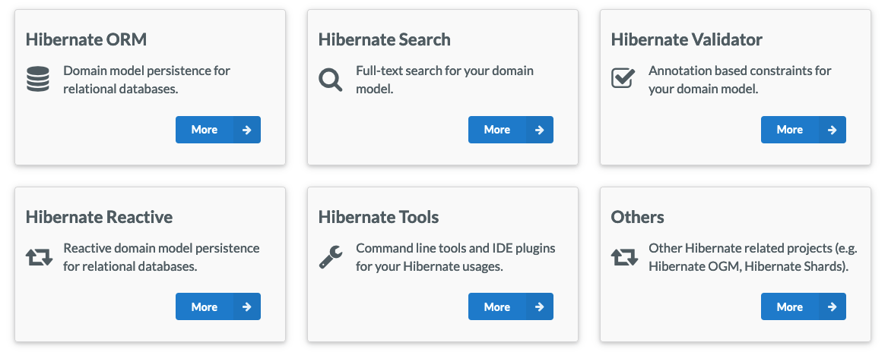

+++
title = "Hibernate"
weight = 70
+++

Hibernate est un ORM qui se présente sous forme de librairies Java que nous pouvons ajouter à notre projet



Pour le moment, nous n'avons besoin que de la librairie suivante
```xml
<dependency>
    <groupId>org.hibernate.orm</groupId>
    <artifactId>hibernate-core</artifactId>
    <version>6.6.1.Final</version>
</dependency>
```

## Configuration Hibernate
Avec JPA nous avions le fichier `persistance.xml`, lorsqu'on utilise Hibernate, nous pouvons garder ce fichier ou bien créer un fichier `resources/hibernate.cfg.xml`.
Ainsi si vous utilisez seulement Hibernate vous pouvez vous permettre d'utiliser `resources/hibernate.cfg.xml` mais si vous souhaitez utiliser la spécification JPA (que je recommande) alors transférer la configuration Hibernate dans `persistance.xml` comme présentez précédemment.
