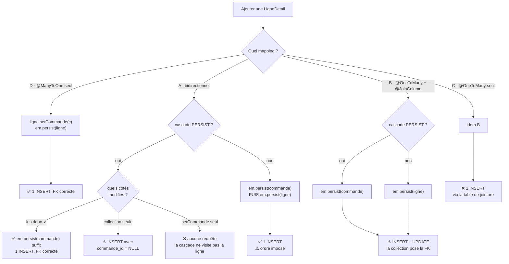

+++
title = "Persister une relation @OneToMany"
description = "Toutes les combinaisons de mapping, de cascade et d'appel à persist() sur une relation @OneToMany, et ce que produit réellement chacune en SQL."
weight = 10
+++

> [!note] Note
> Ceci est une page annexe qui permet d'aller un peu plus long sur la notion de persistance.

Avec une relation `@OneToMany`, « sauvegarder » n'est pas une opération unique. Le résultat dépend de trois choix indépendants : **la variante de mapping**, **la présence d'une cascade**, et **l'entité sur laquelle on appelle `persist()`**. Passons-les en revue.

## Le décor

```java
@Entity
public class Commande {
    @Id @GeneratedValue(strategy = GenerationType.IDENTITY)
    private Long id;
    // la collection varie selon la variante
}

@Entity
public class LigneDetail {
    @Id @GeneratedValue(strategy = GenerationType.IDENTITY)
    private Long id;
    // le @ManyToOne existe ou non selon la variante
}
```

## Deux questions à ne jamais confondre

Tout le sujet tient dans cette séparation, et c'est elle qui explique tous les cas qui suivent.

| Question | Ce qui y répond |
| --- | --- |
| **La ligne est-elle insérée ?** | `em.persist()` sur l'enfant, **ou** la cascade `PERSIST` |
| **La FK a-t-elle la bonne valeur ?** | le **côté propriétaire** de l'association |

`persist()` ne renseigne jamais la clé étrangère. La cascade non plus. Elles décident seulement de l'existence de la ligne.

Ce qui change d'une variante à l'autre, c'est **qui est le côté propriétaire** — et donc qui écrit la FK.

## Variante A — Bidirectionnelle (mappedBy)

```java
@OneToMany(mappedBy = "commande")   // côté inverse
private List<LigneDetail> ligneDetails = new ArrayList<>();

@ManyToOne
@JoinColumn(name = "commande_id")   // côté PROPRIÉTAIRE
private Commande commande;
```

Le propriétaire est le champ `LigneDetail.commande`. La FK est donc écrite **dans l'`INSERT` de la ligne**, directement.

### A1 — Avec cascade

```java
@OneToMany(mappedBy = "commande", cascade = CascadeType.ALL)
```

| Ce qu'on écrit | Résultat |
| --- | --- |
| `commande.addLigneDetail(ligne)` puis `em.persist(commande)` | ✅ `INSERT` commande + `INSERT` ligne avec la bonne FK |
| `getLigneDetails().add(ligne)` seul, puis `em.persist(commande)` | ⚠️ `INSERT` ligne avec `commande_id = NULL` |
| `ligne.setCommande(commande)` seul, puis `em.persist(commande)` | ❌ **aucune requête** pour la ligne — elle n'est pas dans la collection, la cascade ne la visite pas |
| `ligne.setCommande(commande)` seul, puis `em.persist(ligne)` | ✅ `INSERT` avec la bonne FK |

C'est la variante la plus efficace en SQL, et la plus piégeuse en Java : trois écritures sur quatre sont fausses. D'où l'importance des [méthodes de synchronisation]().

### A2 — Sans cascade

La cascade disparaît, donc `em.persist(commande)` ne propage plus rien. Il faut persister chaque entité soi-même, **dans l'ordre** :

```java
commande.addLigneDetail(ligne);

em.persist(commande);   // d'abord le parent : il doit avoir un id
em.persist(ligne);      // puis l'enfant, avec sa FK déjà renseignée
```

Inverser l'ordre donne une `TransientPropertyValueException` : Hibernate tente d'écrire une FK qui pointe vers une commande sans identifiant.

> [!note] Note
> Si l'on oublie le `em.persist(ligne)`, la ligne n'est simplement pas sauvegardée. Selon la configuration, Hibernate peut aussi lever un `object references an unsaved transient instance` au flush — le symptôme n'est pas toujours le même.

## Variante B — @OneToMany + @JoinColumn (unidirectionnelle)

```java
@OneToMany
@JoinColumn(name = "commande_id")   // la COLLECTION est propriétaire
private List<LigneDetail> ligneDetails = new ArrayList<>();

// LigneDetail n'a aucun champ commande
```

Ici le propriétaire change de camp : c'est **la collection**. Et comme `LigneDetail` ne possède aucun champ pour porter sa propre FK, Hibernate ne peut pas l'inclure dans l'`INSERT`. Il procède en deux temps :

```sql
INSERT INTO LigneDetail (id) VALUES (1);              -- sans la FK
UPDATE LigneDetail SET commande_id = 1 WHERE id = 1;  -- puis on la renseigne
```

C'est exactement ce que nous avons vu [Relation unidirectionnelle deux tables - performance]()

### B1 — Avec cascade

```java
ligneDetails.add(ligne);
em.persist(commande);
// → INSERT commande, INSERT ligne, UPDATE ligne SET commande_id
```

✅ Tout fonctionne, et **il n'y a rien à synchroniser** : une seule référence existe. C'est le bénéfice de l'unidirectionnel — au prix de l'`UPDATE` supplémentaire.

### B2 — Sans cascade

Le résultat est instructif.

```java
ligneDetails.add(ligne);
em.persist(ligne);        // obligatoire : plus de cascade pour l'insérer
// → INSERT ligne, puis UPDATE ligne SET commande_id = 1
```

L'`UPDATE` **a quand même lieu**. La cascade ne conditionne que l'`INSERT` ; la mise à jour de la FK, elle, vient du flush de la collection, qui est propriétaire.

> [!affirmation] La démonstration la plus nette
> Sans cascade, `persist()` fait exister la ligne, et la collection écrit sa FK. Les deux mécanismes sont totalement indépendants.

En revanche, `em.persist(commande)` seul ne suffit pas — rien n'insère la ligne.

## Variante C — @OneToMany seul (table de jointure)

```java
@OneToMany   // sans @JoinColumn
private List<LigneDetail> ligneDetails = new ArrayList<>();
```

Même logique que la variante B, mais la relation vit dans une troisième table.

```sql
INSERT INTO LigneDetail (id) VALUES (1);
INSERT INTO Commande_LigneDetail (Commande_id, ligneDetails_id) VALUES (1, 1);
```

La table `LigneDetail` n'a **aucune FK**. Deux `INSERT` par ligne ajoutée, et une jointure supplémentaire à chaque lecture. Le comportement vis-à-vis de la cascade est identique à B.

## Variante D — @ManyToOne seul

```java
// Commande n'a pas de collection
@ManyToOne
@JoinColumn(name = "commande_id")
private Commande commande;
```

Le cas trivial, et le plus sûr.

```java
ligne.setCommande(commande);
em.persist(ligne);   // → INSERT avec la bonne FK
```

Une seule référence, qui est aussi le côté propriétaire. Aucune synchronisation, aucun piège, un seul `INSERT`. La contrepartie : plus de collection, donc **plus de cascade ni d'`orphanRemoval` possibles depuis le parent** — il faut passer par une requête pour lister les lignes d'une commande.

## Le tableau de synthèse

| Variante | Qui écrit la FK | Avec cascade | Sans cascade | SQL par ligne |
| --- | --- | --- | --- | --- |
| **A** bidirectionnelle | `ligne.commande` | `persist(commande)` suffit *si synchronisé* | `persist(ligne)` après le parent | 1 `INSERT` |
| **B** `@JoinColumn` | la collection | `persist(commande)` suffit | `persist(ligne)`, la FK est posée par l'`UPDATE` | `INSERT` + `UPDATE` |
| **C** table de jointure | la table de jointure | `persist(commande)` suffit | `persist(ligne)` | 2 `INSERT` |
| **D** `@ManyToOne` seul | `ligne.commande` | *(pas de cascade possible)* | `persist(ligne)` | 1 `INSERT` |

## Ce qu'il faut en retenir

1. **La cascade répond à « la ligne existe-t-elle ? », jamais à « la FK est-elle bonne ? »**. Ce sont deux mécanismes distincts, et c'est la source de la quasi-totalité des confusions.
2. **La cascade suit la collection.** Si l'enfant n'est pas dans la collection annotée, `persist(parent)` ne le voit pas — même avec `CascadeType.ALL`.
3. **Le côté propriétaire dépend de la variante.** En bidirectionnel c'est le `@ManyToOne` de l'enfant ; en unidirectionnel avec collection, c'est la collection elle-même. La question « qui écrit la FK ? » n'a donc pas de réponse universelle.
4. **Sans cascade, tout redevient explicite** — et c'est parfois préférable quand les entités ont des cycles de vie indépendants. La cascade est un confort, pas une obligation.
5. **Si la collection n'est pas nécessaire**, la variante D élimine l'essentiel du sujet. Voir [Synthèse : quel mapping choisir ?]().

