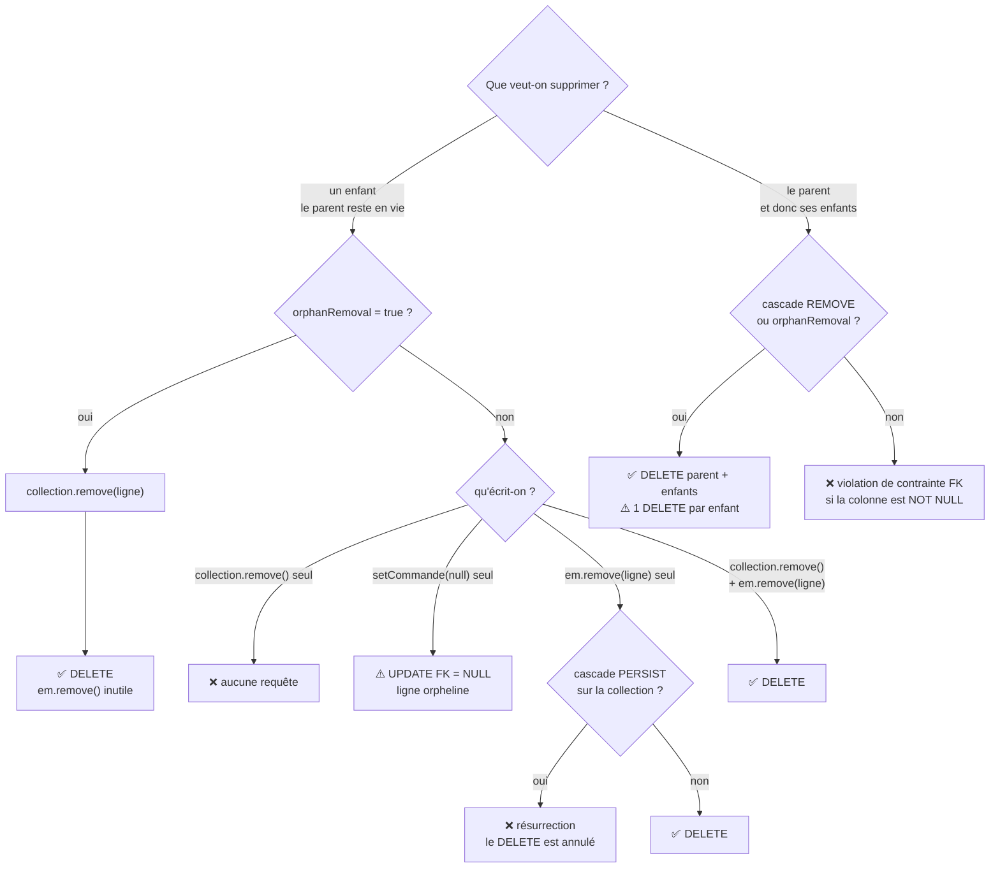

+++
title = "orphanRemoval"
description = "L'attribut orphanRemoval supprime un enfant retiré de la collection de son parent, et se distingue de CascadeType.REMOVE qui propage la suppression du parent."
weight = 65
+++

> [!ressource] Ressource
> - [How does JPA orphanRemoval=true differ from the ON DELETE CASCADE DML clause](https://stackoverflow.com/questions/4329577/how-does-jpa-orphanremoval-true-differ-from-the-on-delete-cascade-dml-clause)
> - [The best way to map a @OneToMany relationship with JPA and Hibernate](https://vladmihalcea.com/the-best-way-to-map-a-onetomany-association-with-jpa-and-hibernate/)

`orphanRemoval` répond à une seule question : **que faire d'un enfant retiré de la collection de son parent ?**

Un *orphelin*, c'est exactement cela — un `Pet` qui n'a plus de `Owner`. Deux réponses sont possibles : le laisser exister sans maître, ou le supprimer.

## Le mapping

Reprenons la relation vue dans l'article [Cascade]().

```java
@Entity
public class Owner {
    ...

    @OneToMany(mappedBy = "owner")
    private List<Pet> pets = new ArrayList<>();
}

@Entity
public class Pet {
    ...

    @ManyToOne
    @JoinColumn(name = "owner_id")
    private Owner owner;
}
```

Et l'opération qui nous intéresse

```java
owner.getPets().remove(pet);
```

## Avec orphanRemoval = false (le défaut)

**Il ne se passe rien du tout.** Aucune requête SQL n'est émise, et si l'on recharge l'owner, l'animal est toujours là.

La raison est plus subtile que « JPA ne supprime pas ». La relation est bidirectionnelle et la collection porte `mappedBy = "owner"` : elle est donc le **côté inverse**. Ce n'est pas elle qui détient la clé étrangère, c'est `Pet.owner`.

Hibernate ne consulte pas cette liste au moment du flush. La colonne `pet.owner_id` pointe toujours vers l'owner, donc rien n'a changé de son point de vue.

> [!warning] Piège classique
> Modifier seule la collection du côté inverse d'une relation bidirectionnelle ne produit **jamais** de SQL. C'est vrai pour `orphanRemoval`, mais aussi pour tout ajout ou retrait dans un `@OneToMany(mappedBy = ...)`.

Pour qu'il se passe quelque chose, il faut toucher le côté propriétaire [cf méthode de synchronisation]()

```java
owner.getPets().remove(pet);
pet.setOwner(null);            // ← c'est cette ligne qui compte
```

Le dirty checking sur `Pet` détecte alors le changement et émet

```sql
UPDATE pet SET owner_id = NULL WHERE id = 3;
```

La ligne existe toujours en base, mais sans maître : **c'est un orphelin**. Et si la colonne `owner_id` est déclarée `NOT NULL`, on récolte une violation de contrainte à la place.

## Avec orphanRemoval = true

```java
@OneToMany(mappedBy = "owner", orphanRemoval = true)
private List<Pet> pets = new ArrayList<>();
```

```java
owner.getPets().remove(pet);
```

Hibernate surveille cette fois les retraits de la collection et en déduit que l'enfant n'a plus de raison d'exister.

```sql
DELETE FROM pet WHERE id = 3;
```

Un seul appel suffit, le `pet.setOwner(null)` devient inutile.

## Récapitulatif

Sur l'opération `owner.getPets().remove(pet)`

| Configuration | SQL émis | État de `pet` |
| --- | --- | --- |
| `orphanRemoval = false` | aucun | toujours rattaché à l'owner |
| `false` + `pet.setOwner(null)` | `UPDATE pet SET owner_id = NULL` | orphelin, la ligne subsiste |
| `orphanRemoval = true` | `DELETE FROM pet` | supprimé |

## Différence avec CascadeType.REMOVE

Les deux mécanismes sont souvent confondus, alors qu'ils répondent à des questions différentes.

| | Déclencheur | Effet |
| --- | --- | --- |
| `CascadeType.REMOVE` | `em.remove(owner)` — le parent disparaît | les enfants sont supprimés avec lui |
| `orphanRemoval = true` | `owner.getPets().remove(pet)` — le parent **reste en vie** | l'enfant retiré est supprimé |

Ils sont complémentaires, et `orphanRemoval = true` implique au passage le comportement de `REMOVE` : supprimer le parent supprime les enfants, puisqu'ils deviennent tous orphelins.

```java
// suppression du parent → les deux configurations suppriment les pets
@OneToMany(mappedBy = "owner", cascade = CascadeType.REMOVE)
@OneToMany(mappedBy = "owner", orphanRemoval = true)

// retrait d'un enfant de la collection → seul orphanRemoval agit
```

## Quand l'activer

Le critère est celui de la **dépendance d'existence** : l'enfant a-t-il un sens sans son parent ?

- `orphanRemoval = true` quand l'enfant est un composant du parent et ne peut vivre seul — une `LigneCommande` sans `Commande`, une `Adresse` sans `Client` ;
- `orphanRemoval = false` quand l'enfant a une existence propre et peut être réaffecté — un `Pet` qui change de maître, un `Employee` qui change de service.

> [!warning] Attention aux suppressions en masse
> Comme `CascadeType.REMOVE`, `orphanRemoval` fonctionne **entité par entité** : Hibernate charge chaque enfant en mémoire puis émet un `DELETE` par ligne. Vider une collection de 500 éléments produit 500 requêtes. Pour une suppression en masse, une requête JPQL `delete from Pet p where p.owner = :owner` reste bien plus efficace.


