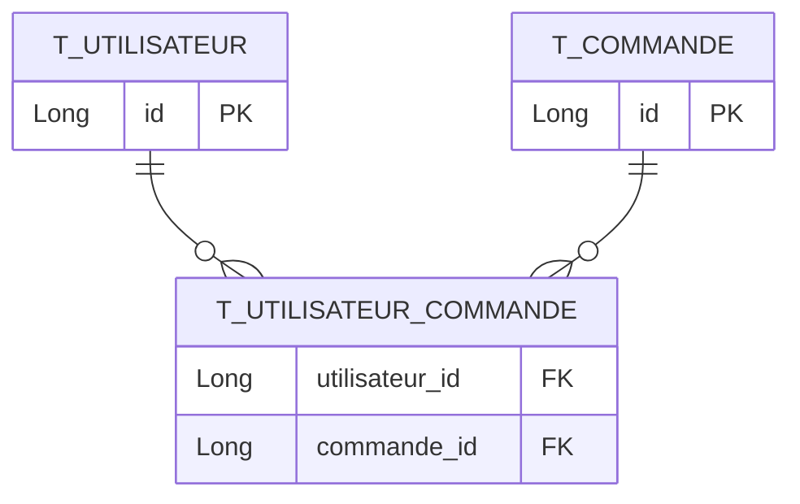
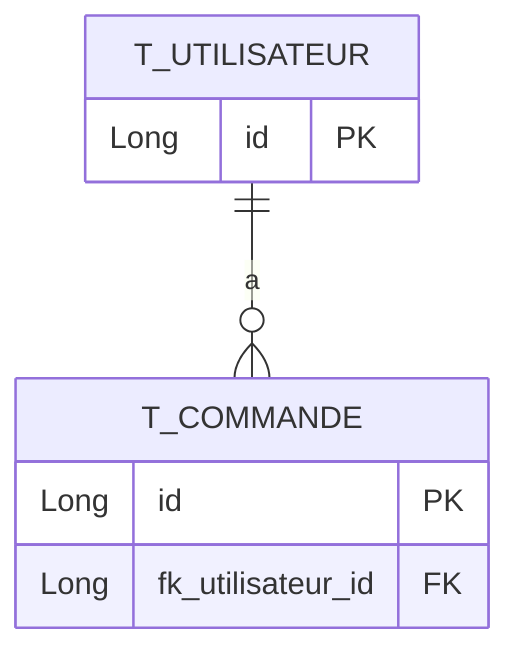

+++
title = "@OneToMany"
weight = 11
+++

> [!ressource] Ressources
> - [The best way to map a @OneToMany relationship with JPA and Hibernate](https://vladmihalcea.com/the-best-way-to-map-a-onetomany-association-with-jpa-and-hibernate/)


## Relation unidirectionnelle
Nous souhaitons représenter la relation un utilisateur peut avoir plusieurs commandes. C’est la classe Commande qui tiendra l’association, en effet, si nous représentons la structure relationnelle SQL nous avons
- une classe `Utilisateur` qui contient contient une collection de `commandes`
- une classe `Commande`

```java
@Entity
public class Utilisateur {
    @Id
    @GeneratedValue(strategy = GenerationType.IDENTITY)
    private Long id;

    @OneToMany
    private List<Commande> commandes = new ArrayList<>();
}
```

```java
@Entity
public class Commande {
    @Id
    @GeneratedValue(strategy = GenerationType.IDENTITY)
    private Long id;
}
```

Mais si nous exécutons le code suivant, nous n'aurons pas uniquement que deux tables (dont `t_commande` avec la FK) mais 3 tables :
- `t_utilisateur`
- `t_commande`
- `t_utilisateur_commande`




> But this is most likely not the mapping you’re looking for because Hibernate uses an association table to map the relationship. **If you want to avoid that, you need to use a @JoinColumn annotation to specify the foreign key column.** [^1]
[^1]: https://thorben-janssen.com/ultimate-guide-association-mappings-jpa-hibernate/#uniOneToMany


## Relation unidirectionnelle deux tables

Pour résoudre le problème de la table de jointure supplémentaire , il suffit d'ajouter la colonne `@JoinColumn`. L'annotation aide Hibernate à comprendre qu'il existe une colonne de clé étrangère `fk_utilisateur_id` dans la table `t_commande` qui définit cette association.

```java
@Entity
public class Utilisateur {

    @Id
    @GeneratedValue(strategy = GenerationType.IDENTITY)
    private Long id;

    @OneToMany
    @JoinColumn(name ="fk_utilisateur_id")
    private List<Commande> commandes = new ArrayList<>();
}
```



### Performance
[L'article cité en ressource](https://vladmihalcea.com/the-best-way-to-map-a-onetomany-association-with-jpa-and-hibernate/) (un MUST READ), nous montre qu'en appliquant uniquement cette stratégie nous nous exposons à un problème de performance. 

Par exemple, si on souhaite insérer une nouvelle commande à un utilisateur. En Java nous réalisons le code suivant
```java
Utilisateur utilisateur = new Utilisateur("Adrien");
utilisateur.setCommandes().add(new Commande("Premier Commentaire"));
utilisateur.setCommandes().add(new Commande("Second Commentaire"));
```

Les instructions SQL seront jouées

```sql
insert into utilisateur (nom, id)
values ('Adrien', 1)

-- 1. Création des commentaires
insert into commentaire (desc, id)
values ('Premier Commentaire', 1)

insert into commentaire (desc, id)
values ('Second Commentaire', 2)

-- 2. Mise à jour des commentaire pour rajouter une valeur dans fk_utilisateur_id
update commentaire set fk_utilisateur_id = 1 where id = 1
update commentaire set fk_utilisateur_id = 1 where id = 2
```

Nous remarquons que l'insertion d'un commentaire ce fait en deux étapes.

## Relation bidirectionnelle
La meilleure façon de mapper une association `@OneToMany` est de s'appuyer sur le côté `@ManyToOne` pour propager tous les changements d'état de l'entité

```java
@Entity
public class Utilisateur {

    @Id
    @GeneratedValue(strategy = GenerationType.IDENTITY)
    private Long id;

    @OneToMany(mappedBy = "utilisateur")
    private List<Commande> commandes = new ArrayList<>();
    
    /**
     * Ajoute une commande à l'utilisateur et synchronise l'association bidirectionnelle.
     */
    public void addCommande(Commande commande) {
        commandes.add(commande);
        commande.setUtilisateur(this);
    }

    /**
     * Retire une commande de l'utilisateur et synchronise l'association bidirectionnelle.
     */
    public void removeCommande(Commande commande) {
        commandes.remove(commande);
        commande.setUtilisateur(null);
    }
```

```java
@Entity
public class Commande {

    @Id
    @GeneratedValue(strategy = GenerationType.IDENTITY)
    private Long id;

    @ManyToOne(fetch = FetchType.LAZY) // par defaut EAGER => moins performant
    @JoinColumn(name = "fk_utilisateur_id") // Optionnel : préciser le nom de la colonne
    private Utilisateur utilisateur;
}
```

Avec cette dernière solution, nous pouvons noter plusieurs choses

### 1. Utilisation de mappedBy
Comme dans la section précédente sur le `@OneToOne` nous utilisons la propriété `mappedBy` pour indiquer :
- Le *inverse side* de la relation, c'est-à-dire le côté qui contient l’attribut mappedBy (nous `Utilisateur`)
- Le *owning side* de la relation, c'est-à-dire le côté de la relation qui onws la clé étrangère (nous `Commande`)

En d'autre terme, la FK **ne** sera **pas** dans la table `Utilisateur`

### 2. Méthodes de synchronisation
Maintenant, même si nous avons défini l'attribut `mappedBy` et que l'association `@ManyToOne` côté enfant gère la colonne de clé étrangère, nous devons toujours synchroniser les deux côtés de l'association bidirectionnelle. La meilleure façon de le faire est d'ajouter ces deux méthodes utilitaires [^2]

[^2]: https://stackoverflow.com/a/60889316/9399016

```java
public class Utilisateur {
    ...
    public void addCommande(Commande commande) {
        commandes.add(commande);
        commande.setUtilisateur(this);
    }

    public void removeCommande(Commande commande) {
        commandes.remove(commande);
        commande.setUtilisateur(null);
    }
}
```

### Performance
Cette fois-ci nous n'avons pas deux étapes pour créer une nouvelle commande mais seulement du `INSERT`

```sql
insert into utilisateur (nom, id)
values ('Adrien', 1)

-- Insertion directement avec la fk_utilisateur_id
insert into commentaire (fk_utilisateur_id, desc, id)
values (1, 'Premier Commentaire', 1)

insert into commentaire (fk_utilisateur_id, desc, id)
values (1, 'Second Commentaire', 2)
```
