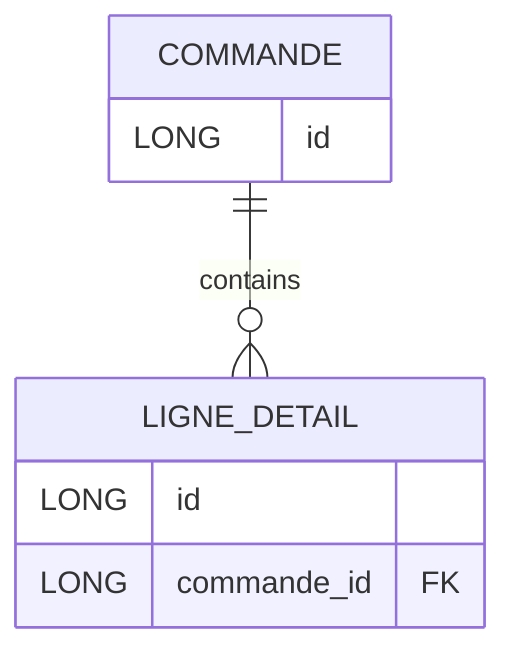

+++
title = "TD4 JPA OrphanRemoval"
weight = 60
+++

> [!ressource] Ressources
> - [How does JPA orphanRemoval=true differ from the ON DELETE CASCADE](https://stackoverflow.com/a/60838256/9399016)

> [!warning] Note
> On notera la **non**-présence de `CASCADE_TYPE.ALL`, car dans le cas d'une suppression `CASCADE_TYPE.REMOVE` et `orphanRemoval` sont redondants[^1]



```java
@Entity
public class Commande {

    @Id
    @GeneratedValue(strategy = GenerationType.IDENTITY)
    private Long id;

    @OneToMany(mappedBy = "commande") // pas orphanRemoval
    private List<LigneDetail> ligneDetails = new ArrayList<LigneDetail>();
}

@Entity
public class LigneDetail {

    @Id
    @GeneratedValue(strategy = GenerationType.IDENTITY)
    private Long id;


    @ManyToOne
    private Commande commande;
}
```

## Sans orphanRemoval
> If your relationship does not have orphan removal, then updating the child from the parent’s collection alone won’t trigger a update.

Par exemple, nous souhaitons supprimer une `ligneDetail` d'une `commande`

```java
@Test
public void testRemoveLigneDetail() {
    Session session = sessionFactory.openSession();
    Transaction transaction = session.beginTransaction();
    
    // Récupérer la commande id=2
    Commande commande = session.find(Commande.class, 2L);

    //  Récupérer une ligne associée à la commande (ici la première ligne)
    LigneDetail ligneDetail = commande.getLigneDetails().get(0);

    transaction.commit();
}
```

Dans ce cas, le simple fait de supprimer le `LigneDetail` de la collection du parent ne met pas automatiquement à jour la clé étrangère dans la base de données. 
Sans `ligneDetail.setCommande(null)`, Hibernate ne saura pas qu'il est censé rompre cette relation. Cela dépend de l'ordre de validation et des types de cascade :

```java
@Test
public void testRemoveLigneDetail() {
    Session session = sessionFactory.openSession();
    Transaction transaction = session.beginTransaction();
    
    Commande commande = session.find(Commande.class, 2L);
    LigneDetail ligneDetail = commande.getLigneDetails().get(0);

    ligneDetail.setCommande(null); // ADD THIS

    transaction.commit();
}
```

## Avec orphanRemoval
Si nous modifions notre entité `Commande` pour ajouter l'option `orphanRemoval`

```java
@OneToMany(mappedBy = "commande" orphanRemoval = true)
private List<LigneDetail> ligneDetails = new ArrayList<LigneDetail>();
```

Alors la suppression de l'enfant de la collection du parent suffira pour qu'Hibernate le supprime de la base de données. Ainsi `ligneDetail.setCommande(null);` n'est plus requis.

> [!definition] Définition
> `orphanRemoval` is an entirely ORM-specific thing. It marks "child" entity to be removed when it's no longer referenced from the "parent" entity, e.g. when you remove the child entity from the corresponding collection of the parent entity. [^1]

[^1]: https://stackoverflow.com/a/4329723/9399016

