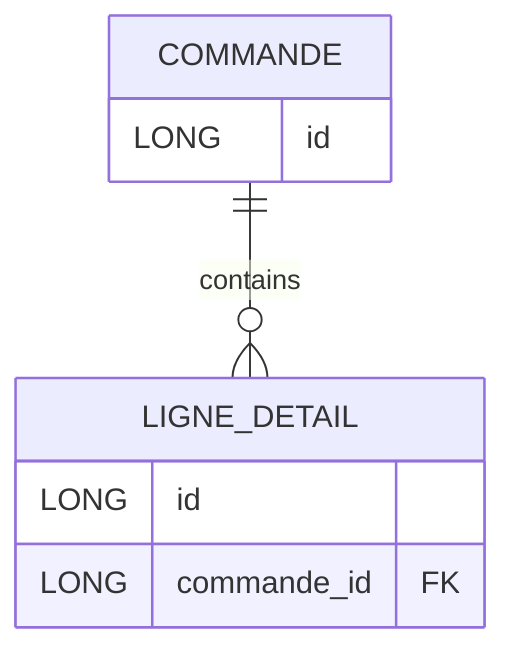

+++
title = "TD3 JPA Relation Bidirectionnelle"
weight = 40
+++

> [!ressource] Ressource
> [https://github.com/Adrien-Courses/R605-TD-JPA-synchronize-bidirectional](https://github.com/Adrien-Courses/R605-TD-JPA-synchronize-bidirectional) - voir la classe `test/CommandeTest`

Dans les cas pratiques suivant, nous souhaitons comprendre l'utilité de la relation bidirectionnelle expliquée dans les sections [OneToMany relation]() et [MappedBy]().
Pour ce faire nous prenons le cas :
- d'une `Commande`
- qui est composée de plusieurs lignes `LigneDetail` (i.e. un bon de commande est composé de plusieurs lignes représentant chacune des articles)



```java
@Entity
public class Commande {

    @Id
    @GeneratedValue(strategy = GenerationType.IDENTITY)
    private Long id;

    @OneToMany(mappedBy = "commande", cascade = CascadeType.ALL)
    private List<LigneDetail> ligneDetails = new ArrayList<LigneDetail>();
}

@Entity
public class LigneDetail {

    @Id
    @GeneratedValue(strategy = GenerationType.IDENTITY)
    private Long id;


    @ManyToOne
    private Commande commande;
}
```


## 1. Supprimer une ligne d'une commande (NOT WORKING)
Premièrement, regardons ce qu'il se passe si nous ne synchronisons pas les deux côtés de la relation.

```java
@Test
public void testRemoveLigneDetailNotWorking() {
    // Récupérer la commande id=1
    Commande commande = em.find(Commande.class, 1L);

    //  Récupérer une ligne associée à la commande (ici la première ligne)
    LigneDetail ligneDetail = commande.getLigneDetails().get(0);

    // NOT WORKING      
    em.remove(ligneDetail);
}
```
> [!faq]- Quelles requêtes vont être exécutées ?
> ```
> [Hibernate] 
>    select
>        c1_0.id 
>    from
>        Commande c1_0 
>    where
>        c1_0.id=?
> [Hibernate] 
>    select
>        ld1_0.commande_id,
>        ld1_0.id 
>    from
>        LigneDetail ld1_0 
>    where
>        ld1_0.commande_id=?
> ```
>
> Aucun delete !


## 2. Non suffisant
```java
@Test
public void testRemoveLigneDetailInsuffisant() {    
    Commande commande = em.find(Commande.class, 1L);

    //  Récupérer une ligne associée à la commande (ici la première ligne)
    LigneDetail ligneDetail = commande.getLigneDetails().get(0);
    ligneDetail.setCommande(null) // THIS ADDED

    // NOT WORKING      
    em.remove(ligneDetail)
}
```

> [!faq]- Quelles requêtes vont être exécutées ?
> ```
> [Hibernate] 
>     select
>         c1_0.id 
>     from
>         Commande c1_0 
>     where
>         c1_0.id=?
> [Hibernate] 
>     select
>         ld1_0.commande_id,
>         ld1_0.id 
>     from
>         LigneDetail ld1_0 
>     where
>         ld1_0.commande_id=?
> [Hibernate] 
>     update 
>         LigneDetail 
>     set
>         commande_id=?  (à null)
>     where
>         id=?
> ```
>
> La `ligneDetail` n'a pas été supprimée mais seulement update avec la FK `commande_id` à NULL. Ainsi, même si nous n'avons plus la relation vers la commande mais nous avons une ligneDetail orpheline ...
>
>```
>mysql> select * from LigneDetail;
>+-------------+----+
>| commande_id | id |
>+-------------+----+
>|        NULL | 1  |  -- LigneDetail orpheline
>+-------------+----+
>```


## 3. Supprimer une ligne d'une commande (WORKING)
Dans le code precedent, la ligne était toujours associée à la commande.
Nous devons donc supprimer également cette association 
```java
@Test
public void testRemoveLigneDetailWorking() {
    Commande commande = em.find(Commande.class, 1L);
    
    LigneDetail ligneDetail = commande.getLigneDetails().get(0);
    commande.getLigneDetails().remove(ligneDetail); // ADD THIS
            
    em.remove(ligneDetail)}
```

> [!faq]- Quelles requêtes vont être exécutées ?
> ```
> [Hibernate] 
>     select
>         c1_0.id 
>     from
>         Commande c1_0 
>     where
>         c1_0.id=?
> [Hibernate] 
>     select
>         ld1_0.commande_id,
>         ld1_0.id 
>     from
>         LigneDetail ld1_0 
>     where
>         ld1_0.commande_id=?
> [Hibernate] 
>     delete 
>     from
>         LigneDetail 
>     where
>         id=?
> ```
> Nous avons bien un delete !

## 4. Supprimer une ligne d'une commande BIDIRECTIONAL

Mais, ceci n'est pas parfait
> By using the bidirectional add sync methods, we can ensure that the persist entity state transition is going to be propagated properly. Without synchronizing both sides of the JPA association, it’s not guaranteed that the entity state will be properly synchronized with the database. [source](https://vladmihalcea.com/jpa-bidirectional-sync-methods/)

```java
@Test
public void testRemoveLigneDetailWorkingConventional() {
    Commande commande = em.find(Commande.class, 1L);
    
    LigneDetail ligneDetail = commande.getLigneDetails().get(0);
    commande.getLigneDetails().remove(ligneDetail); // ADD THIS
    ligneDetail.setCommande(null); // ADD THIS

    em.remove(ligneDetail);
}
```

> [!faq]- Quelles requêtes vont être exécutées ?
> ```
> [Hibernate] 
>     select
>         c1_0.id 
>     from
>         Commande c1_0 
>     where
>         c1_0.id=?
> [Hibernate] 
>     select
>         ld1_0.commande_id,
>         ld1_0.id 
>     from
>         LigneDetail ld1_0 
>     where
>         ld1_0.commande_id=?
> [Hibernate] 
>     delete 
>     from
>         LigneDetail 
>     where
>         id=?
> ```
> Nous avons bien un delete !
>
>On peut donc se demander si l'option 3. avec seulement la ligne `commande.getLigneDetails().remove(ligneDetail);` est suffisante.
>- En précisant les deux côtés de la relation nous nous assurons de la consistence des données (sans il se pourrait que des problème de synchronization en base de données se produisent)
>- Donc par convention nous synchronisons les deux côtés


## 5. Amélioration
> [!ressource] Ressource
> Voir également [MappedBy et copie défensive]()

**Comment s'assurer que les développeurs n'oublie pas de synchroniser les deux côté de la relation ?**

Dans la classe `Commande` il est recommandé d'ajouter les méthodes suivante qui viennent simplement remplacer dans nos exemple les deux appels
```java
commande.getLigneDetails().remove(ligneDetail); // ADD THIS
ligneDetail.setCommande(null); // ADD THIS
```

```java
public class Commande {
	public void addLigneDetails(LigneDetail ligneDetail) {
        ligneDetail.setCommande(this); // this référence la commande
        igneDetails.add(ligneDetail);
	}

    public void removeLigneDetails(LigneDetail ligneDetail) {
        ligneDetail.setCommande(null);
        ligneDetails.remove(ligneDetail);
	}
}
```

Maintenant, plus aucune excuse pour les développeurs ils n'ont qu'à utiliser ces deux méthodes !

```java
@Test
public void improvement() {
    Commande commande = em.find(Commande.class, 1L);
    
    LigneDetail ligneDetail = commande.getLigneDetails().get(0);
    // commande.getLigneDetails().remove(ligneDetail); 
    // ligneDetail.setCommande(null); 

    // DEVIENT
    commande.removeLigneDetails(ligneDetail)

    em.persist(commande); // optionnelle car commande est un objet MANAGED
}
```


<!--

### Créer une commande avec le même Id
Que se passe-t-il si on crée un nouvel objet commande qui a le même id qu'un déjà sauvegardé en base de données et qu'on y ajoute une nouvelle ligne ?

Actuellement en base de données
```
mysql> select * from Commande;
+----+
| id |
+----+
|  1 |
+----+

mysql> select * from LigneDetail;
+-------------+----+
| commande_id | id |
+-------------+----+
|           1 |  1 |
+-------------+----+
```

```java
@Test
public void testAjouterLigneDetailANouvelleCommande() {
    Session session = sessionFactory.openSession();
    Transaction transaction = session.beginTransaction();

    // Création d'un nouvel objet commande et on y associe id=1
    Commande commande = new Commande();
    commande.setId(1L);

    
    List<LigneDetail> ligneDetails = new ArrayList<LigneDetail>();
    LigneDetail ligneDetail = new LigneDetail();
    ligneDetail.setCommande(commande); // On side
    ligneDetails.add(ligneDetail);
    
    
    commande.setLigneDetails(ligneDetails); // Other side 

    session.saveOrUpdate(commande);

    transaction.commit();
    sessionFactory.close();
}
```

```
mysql> select * from Commande;
+----+
| id |
+----+
|  1 |
+----+

mysql> select * from LigneDetail;
+-------------+----+
| commande_id | id |
+-------------+----+
|           1 |  1 |
|           1 |  2 |
+-------------+----+

Et seulement le SQL suivant a été exécuté
[Hibernate] 
    insert 
    into
        LigneDetail
        (commande_id) 
    values
        (?)
```

### Créer une commande avec find()
Maintenant si on souhaite faire la même chose mais en utilisant `find()` alors ça ne fonctionne pas

```java
@Test
public void testFindCommandeEtAjouterLigneDetail() {
    // Begin a transaction
    Session session = sessionFactory.openSession();
    Transaction transaction = session.beginTransaction();

    Commande commande = session.find(Commande.class, 1L);

    List<LigneDetail> ligneDetails = new ArrayList<LigneDetail>();
    LigneDetail ligneDetail = new LigneDetail();
    ligneDetail.setCommande(commande);
    ligneDetails.add(ligneDetail);
    
    
    commande.setLigneDetails(ligneDetails);


    session.saveOrUpdate(commande);

    transaction.commit();
    sessionFactory.close();
}

jakarta.persistence.RollbackException: Error while committing the transaction
Caused by: org.hibernate.HibernateException: A collection with orphan deletion was no longer referenced by the owning entity instance: fr.adriencaubel.hibernatetesting.Commande.ligneDetails
```

Pour que ça fonctionne nous devons ajouter 

```java
@Test
public void testFindCommandeEtAjouterLigneDetailWorking() {
    // Begin a transaction
    Session session = sessionFactory.openSession();
    Transaction transaction = session.beginTransaction();

    Commande commande = session.find(Commande.class, 1L);

    LigneDetail ligneDetail = new LigneDetail();
    ligneDetail.setCommande(commande);
    commande.getLigneDetails().add(ligneDetail);

    // Save the updated Commande object
    session.saveOrUpdate(commande);
    transaction.commit();
    sessionFactory.close();
} 
```

OUI ... logique car ligneDetails.add(ligneDetail); ajoute à la collection locale je dirais
-->