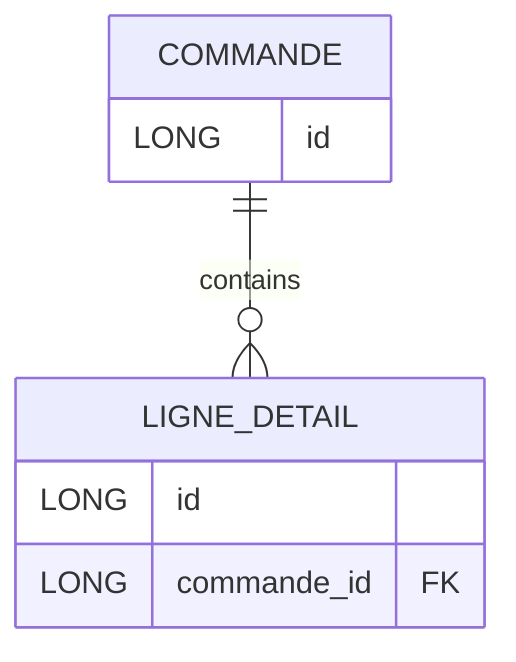

+++
title = "Ajout Ligne/LigneDetail"
description = "TD3 JPA : pourquoi ajouter une ligne de commande ne fonctionne pas comme prévu, et comment une relation bidirectionnelle corrige le problème."
weight = 10
+++


> [!ressource] Ressource
> [https://github.com/Adrien-Courses/R605-TD-JPA-synchronize-bidirectional](https://github.com/Adrien-Courses/R605-TD-JPA-synchronize-bidirectional) - voir la classe `test/CommandeTest`

Dans les cas pratiques suivant, nous souhaitons comprendre l'utilité de la relation bidirectionnelle expliquée dans les sections [OneToMany relation]() et [MappedBy]().
Pour ce faire nous prenons le cas :
- d'une `Commande`
- qui est composée de plusieurs lignes `LigneDetail` (i.e. un bon de commande est composé de plusieurs lignes représentant chacune des articles)



```java
@Entity
public class Commande {

    @Id
    @GeneratedValue(strategy = GenerationType.IDENTITY)
    private Long id;

    @OneToMany(mappedBy = "commande", cascade = CascadeType.ALL)
    private List<LigneDetail> ligneDetails = new ArrayList<LigneDetail>();
}

@Entity
public class LigneDetail {

    @Id
    @GeneratedValue(strategy = GenerationType.IDENTITY)
    private Long id;


    @ManyToOne
    private Commande commande;
}
```


## 1. Ajouter une ligne d'une commande (NOT WORKING)
Premièrement, regardons ce qu'il se passe si nous ne synchronisons pas les deux côtés de la relation.

```java
@Test
public void testAddLigneDetailNotWorking() {
    Commande commande = em.find(Commande.class, 1L);

    LigneDetail ligneDetail = new LigneDetail();
    commande.getLigneDetails().add(ligneDetail); // Côté INVERSE uniquement (mappedBy)

    em.persist(ligneDetail); // La ligne est insérée mais commande_id reste NULL

    transaction.commit();

    // Vider le cache de premier niveau pour relire réellement la base
    em.clear();

    Commande commandeRelue = em.find(Commande.class, 1L);
    assertEquals(2, commandeRelue.getLigneDetails().size());               // la 3e ligne n'est pas rattachée
    assertNull(em.find(LigneDetail.class, ligneDetail.getId()).getCommande()); // FK NULL
}
```

Le `em.clear()` est essentiel : sans lui, `em.find()` renverrait les instances déjà présentes dans le contexte de persistance, et la collection en mémoire contiendrait la nouvelle ligne. Les assertions porteraient alors sur l'état Java, pas sur l'état de la base.
> [!faq]- Quelles requêtes vont être exécutées ?
> ```
> [Hibernate] 
>     insert 
>    into
>        Commande
>        
>    values
>        ( )
> [Hibernate] 
>    insert 
>    into
>        LigneDetail
>        (commande_id) 
>    values
>        (?)   -- ⚠️ la valeur passée est NULL
> ```
>
> L'`INSERT` a bien lieu, puisque nous avons explicitement demandé la persistance de la ligne. Mais la valeur de `commande_id` provient de `ligneDetail.commande`, qui n'a jamais été renseigné.
>
> ```
> mysql> select * from LigneDetail;
> +-------------+----+
> | commande_id | id |
> +-------------+----+
> |        NULL | 3  |  -- la ligne existe, la relation non
> +-------------+----+
> ```
>
> **La collection ne sert jamais à écrire la clé étrangère.** Elle sert uniquement à déterminer quelles entités la cascade va visiter (et, si `orphanRemoval = true`, lesquelles sont devenues orphelines).


## 2. Ajoute une ligne d'une commande (WORKING)
```java
@Test
public void testAddLigneDetailWorkingOwningSide() {    
    Commande commande = em.find(Commande.class, 1L);

    LigneDetail ligneDetail = new LigneDetail();
    ligneDetail.setCommande(commande); // THIS ADDED : côté PROPRIÉTAIRE

	em.persist(ligneDetail); // La FK est bien écrite en base
}
```

> [!faq]- Quelles requêtes vont être exécutées ?
> ```
> [Hibernate] 
>    insert 
>    into
>        Commande
>        
>    values
>        ( )
> [Hibernate]  
>   insert 
>   into
>        LigneDetail
>        (commande_id) 
>    values
>        (?)
> ```

## 2bis Regardons d'un peu plus prêt

Oui en BDD on a bien le nombre de ligne attendu, mais en mémoire Java ?
- Le total calculé ligne 8 donne 2 éléments en mémoire au lieu de 3 attendus !
- Il faut attendre une nouvelle session (ligne 12) pour bien avoir 3 éléments

```java {8, 12}
Commande commande = em.find(Commande.class, 1L);

LigneDetail ligneDetail = new LigneDetail();
ligneDetail.setCommande(commande); // THIS ADDED : côté PROPRIÉTAIRE

em.persist(ligneDetail); // La FK est bien écrite en base

transaction.commit();

// En base c'est correct... mais le modèle objet en mémoire est faux :
// la collection n'a jamais été mise à jour - on a que deux élément au lieu de trois
assertEquals(2, commande.getLigneDetails().size());

// Après rechargement depuis la base, on retrouve bien les 3 lignes
em.clear();
Commande commandeRelue = em.find(Commande.class, 1L);  // comme clear() on va à rechercher depuis la BDD
assertEquals(3, commandeRelue.getLigneDetails().size());
```


## 3. Ajouter une ligne d'une commande (WORKING)
Donc la solution est de synchroniser les deux côtés de la relation

> By using the bidirectional add sync methods, we can ensure that the persist entity state transition is going to be propagated properly. Without synchronizing both sides of the JPA association, it’s not guaranteed that the entity state will be properly synchronized with the database. [source](https://vladmihalcea.com/jpa-bidirectional-sync-methods/)


```java
@Test
public void testAddLigneDetailWorkingConventional() {
Commande commande = em.find(Commande.class, 1L);

LigneDetail ligneDetail = new LigneDetail();
ligneDetail.setCommande(commande); // THIS ADDED
commande.getLigneDetails().add(ligneDetail); // THIS ADDED

// Comme CASCADE.ALL, pas besoin de persist explicite sur la ligne
transaction.commit();

// Cohérent en mémoire...
assertEquals(3, commande.getLigneDetails().size());

// ... et en base
em.clear();
Commande commandeRelue = em.find(Commande.class, 1L);
assertEquals(3, commandeRelue.getLigneDetails().size());

em.close();
emf.close();
}
```

> [!faq]- Quelles requêtes vont être exécutées ?
> ```
> [Hibernate]  
>   insert 
>   into
>        LigneDetail
>        (commande_id) 
>    values
>        (?)
> ```
>
> **Exactement le même SQL qu'au test 2.** La différence ne se voit pas en base de données, mais en mémoire : c'est l'objet `commande` qui est cette fois cohérent avec ce qui a été persisté.

## Conclusion

- Le test 1 nous montre que `commande.getLigneDetails().add(ligneDetail);` n'est pas suffisant, nous avons la FK à NULL
- Le test 2 nous montre qu'il faut à minima `ligneDetail.setCommande(commande);` mais si on accède ligne `commande.getLigneDetails().size()` avoir d'avoir ouvert une nouvelle session nous n'aurons pas le bon résultat
- => La solution est donc de synchroniser les deux côtés de la relation