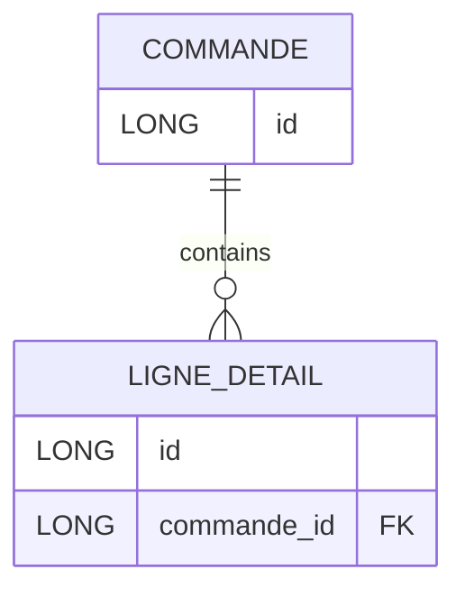

+++
title = "TD4 JPA OrphanRemoval"
weight = 60
+++

> [!ressource] Ressources
> - [How does JPA orphanRemoval=true differ from the ON DELETE CASCADE](https://stackoverflow.com/a/60838256/9399016)



```java
@Entity
public class Commande {

    @Id
    @GeneratedValue(strategy = GenerationType.IDENTITY)
    private Long id;

    @OneToMany(mappedBy = "commande") // pas orphanRemoval
    private List<LigneDetail> ligneDetails = new ArrayList<LigneDetail>();
}

@Entity
public class LigneDetail {

    @Id
    @GeneratedValue(strategy = GenerationType.IDENTITY)
    private Long id;


    @ManyToOne
    private Commande commande;
}
```

## Sans orphanRemoval
> If your relationship does not have orphan removal, then updating the child from the parent’s collection alone won’t trigger a update.

Par exemple, nous souhaitons supprimer une `ligneDetail` d'une `commande` et en utilisant la méthode `persist()`

```java
@Test
public void testRemoveLigneDetail() {
    Session session = sessionFactory.openSession();
    Transaction transaction = session.beginTransaction();
    
    // Récupérer la commande id=2
    Commande commande = session.find(Commande.class, 2L);

    //  Récupérer une ligne associée à la commande (ici la première ligne)
    LigneDetail ligneDetail = commande.getLigneDetails().get(0);

    commande.removeLigneDetail(ligneDetail);

    em.persist(commande) // au lieu de remove()

    transaction.commit();
}
```

- `commande.removeLigneDetail(ligneDetail);` permet de dé-référencement des deux côté de la relation
- En effet, le persist() update la ligneDetail en base avec un FK `NULL`

Néanmoins nous souhaiterons dire que lorsque la FK est null alors supprimer la ligne
- On peut utiliser effectivement `remove()`, mais gardons le `persist()` pour l'exemple

## Avec orphanRemoval
Si nous modifions notre entité `Commande` pour ajouter l'option `orphanRemoval`

```java
@OneToMany(mappedBy = "commande" orphanRemoval = true)
private List<LigneDetail> ligneDetails = new ArrayList<LigneDetail>();
```

Cette fois-ci le fait de garder `persist()` fonctionnera 

> [!definition] Définition
> `orphanRemoval` is an entirely ORM-specific thing. It marks "child" entity to be removed when it's no longer referenced from the "parent" entity, e.g. when you remove the child entity from the corresponding collection of the parent entity. [^1]

[^1]: https://stackoverflow.com/a/4329723/9399016

