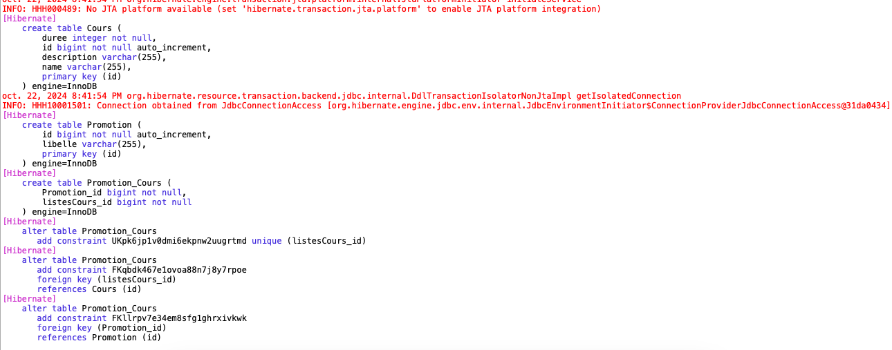

+++
title = "TP2 JPA Mapping"
weight = 50
+++

> [!ressource] Ressources
> - [Le TP : commit nommé "Initial"](https://github.com/Adrien-Courses/R605-TP-JPA.git)

Ce TP va vous permettre d'approfondir la relation `@OneToMany` et de comprendre la notion de relation unidirectionnelle et bidirectionnelle.
## Avant de commencer 
### Le docker-compose
- Lancer le container docker via `docker compose up`
- Accéder au container `docker exec -it <container-id> bash`
  
Vous pouvez maintenant utiliser mysql en ligne de commande
- connectez-vous au serveur via `mysql -uroot -p` puis saisir le mot de passe contenu dans le docker-compose
- Lister les bases : `SHOW DATABASES;`
- Accéder à une base `USE <database-name>;`
- Afficher les tables `SHOW TABLES;`

### Lancer le Client java
Le fichier `persistence.xml` est configuré pour pointer directement vers le docker et la database
```xml
<property name="jakarta.persistence.jdbc.url" value="jdbc:mysql://localhost:3306/training-jpa" />
<property name="jakarta.persistence.jdbc.user" value="root" />
<property name="jakarta.persistence.jdbc.password" value="password" />
<property name="jakarta.persistence.jdbc.driver" value="com.mysql.cj.jdbc.Driver" />
```

Ainsi, en lançant simplement le client vous ne devriez pas avoir d'erreur.

```
INFO: HHH000204: Processing PersistenceUnitInfo [name: org.hibernate.tutorial.jpa]
oct. 22, 2024 8:26:45 PM org.hibernate.Version logVersion
INFO: HHH000412: Hibernate ORM core version 6.6.1.Final
oct. 22, 2024 8:26:45 PM org.hibernate.cache.internal.RegionFactoryInitiator initiateService
INFO: HHH000026: Second-level cache disabled
oct. 22, 2024 8:26:45 PM org.hibernate.engine.jdbc.connections.internal.DriverManagerConnectionProviderImpl configure
WARN: HHH10001002: Using built-in connection pool (not intended for production use)
oct. 22, 2024 8:26:45 PM org.hibernate.engine.jdbc.env.internal.JdbcEnvironmentInitiator initiateService
INFO: HHH10001005: Database info:
	Database JDBC URL [jdbc:mysql://localhost:3306/training-jpa]
	Database driver: com.mysql.cj.jdbc.Driver
	Database version: 8.0.40
	Autocommit mode: false
	Isolation level: undefined/unknown
	Minimum pool size: 1
	Maximum pool size: 20
oct. 22, 2024 8:26:45 PM org.hibernate.engine.transaction.jta.platform.internal.JtaPlatformInitiator initiateService
INFO: HHH000489: No JTA platform available (set 'hibernate.transaction.jta.platform' to enable JTA platform integration)
```

Attention, nous utilisons ici `<property name="jakarta.persistence.schema-generation.database.action" value="drop-and-create" />` avec `drop-and-create` ceci efface toutes les tables et les recrées à chaque lancement

## Créer les entités
Une `Promotion` est composé de `Cours`. Écrire les entités JPA pour représenter cette relation unidirectionnelle


classDiagram
    direction LR
    class Promotion {
        -String libelle
        -List~Cours~ listesCours
    }

    class Cours {
        -String name
        -int durée
        -String description
    }

    Promotion --> Cours : "has many"


**Question**
- Que devons nous coder ?
- Quel est le schéma en base de données qui a été créé ?

```java
@Entity
public class Promotion {

    @Id
    @GeneratedValue(strategy = GenerationType.IDENTITY)
    private Long id;

    private String libelle;

    @OneToMany
    private List<Cours> listesCours;
}
```

```java
@Entity
public class Cours {

    @Id
    @GeneratedValue(strategy = GenerationType.IDENTITY)
    private Long id;

    private String name;
    private int duree;
    private String description;
}
```

Lorsque vous relancer le `main()` nous pouvons regarder les logs est voir ce qu'il sait passé côté base de données



### Tables créées ?
```
mysql > USE training-jpa;
mysql > SHOW TABLES;
```

Nous remarquons que 3 tables ont été créé
```
+------------------------+
| Tables_in_training-jpa |
+------------------------+
| Cours                  |
| Promotion              |
| Promotion_Cours        |
+------------------------+
```

**En effet, une relation 1 vers N unidirectionnelle utilise une table de jointure avec JPA.** Pour savoir *pourquoi?* [Cas des relations one to many unidirectionnelles](https://youtu.be/5BJbPC77Bws?list=PLzzeuFUy_CnhVfJIKyc3okTiiCc0anutx)

Nous pouvons également inspecter cette table de jointure via la commande `DESCRIBE Promotion_Cours;`
```
+----------------+--------+------+-----+---------+-------+
| Field          | Type   | Null | Key | Default | Extra |
+----------------+--------+------+-----+---------+-------+
| Promotion_id   | bigint | NO   | MUL | NULL    |       |
| listesCours_id | bigint | NO   | PRI | NULL    |       |
+----------------+--------+------+-----+---------+-------+
```

## Insérer des données
- En Java écrire le code pour créer une promotion INFO3 avec les cours Java et Architecture Logicielle

```java
/**
 * Si on n'utilise pas le CascadeType.ALL, nous devons d'abord perister les cours puis seulement la promotion ensuite
 */
public class DeuxPersist {

    public static void main(String[] args) {
        // Créer une instance de l'EntityManagerFactory avec l'unité de persistance configurée
        EntityManagerFactory emf = Persistence.createEntityManagerFactory("org.hibernate.tutorial.jpa");
        EntityManager em = emf.createEntityManager();

        // Créer une transaction
        EntityTransaction transaction = em.getTransaction();
        transaction.begin();

        try {
            // Créer les objets Cours
            Cours coursJava = new Cours("Java", 40, "Programmation Java avancée");
            Cours architectureLogicielle = new Cours("Architecture Logicielle", 45, "Principes de l'architecture logicielle");

            // Persister les cours dans la base de données
            em.persist(coursJava);
            em.persist(architectureLogicielle);

            // Créer une liste de cours
            List<Cours> coursList = new ArrayList<>();
            coursList.add(coursJava);
            coursList.add(architectureLogicielle);

            // Créer l'objet Promotion et lui associer les cours
            Promotion promotionINFO3 = new Promotion("INFO3");
            promotionINFO3.setListesCours(coursList);

            // Persister la promotion dans la base de données
            em.persist(promotionINFO3);

            // Valider la transaction
            transaction.commit();
            System.out.println("Promotion et cours créés avec succès !");
            
        } catch (Exception e) {
            // Si une erreur survient, annuler la transaction
            transaction.rollback();
            e.printStackTrace();
        } finally {
            // Fermer l'EntityManager
            em.close();
            emf.close();
        }
    }
}
```

Nous pouvons vérifier le contenue des tables, par exemple
```
mysql> SELECT * FROM Promotion_Cours;
+--------------+----------------+
| Promotion_id | listesCours_id |
+--------------+----------------+
|            1 |              1 |
|            1 |              2 |
+--------------+----------------+
```

## Comment éviter de persister 2 fois ?
Néanmoins, dans la solution précédente, nous avons du persister :
- en premier l'ensemble des cours
- puis seulement la promotion

Comment, résoudre ce problème ? Nous devons rajouter l'attribut `cascade` sur notre relation `OneToMany`. => JPA s'occupera automatiquement de persister les entités associées (comme les cours) si la relation est bien configurée

```java
@Entity
public class Promotion {
    ...

    @OneToMany(cascade=CascadeType.ALL)
    private List<Cours> listesCours;
}
```

### Adapter le code
Vous pouvez maintenant adapter le code

```java
public class UnPersist {

    public static void main(String[] args) {
        // Créer une instance de l'EntityManagerFactory avec l'unité de persistance configurée
        EntityManagerFactory emf = Persistence.createEntityManagerFactory("org.hibernate.tutorial.jpa");
        EntityManager em = emf.createEntityManager();

        // Créer une transaction
        EntityTransaction transaction = em.getTransaction();
        transaction.begin();

        try {
            // Créer les objets Cours
            Cours coursJava = new Cours("Java", 40, "Programmation Java avancée");
            Cours architectureLogicielle = new Cours("Architecture Logicielle", 45, "Principes de l'architecture logicielle");
            Cours uml = new Cours("UML", 130, "UML Design");

            
            // Créer une liste de cours
            List<Cours> coursList = new ArrayList<>();
            coursList.add(coursJava);
            coursList.add(architectureLogicielle);
            coursList.add(uml);


            // Créer l'objet Promotion et lui associer les cours
            Promotion promotionINFO3 = new Promotion("INFO3");
            promotionINFO3.setListesCours(coursList);

            // Persister la promotion (les cours seront persistés automatiquement grâce à CascadeType.PERSIST)
            em.persist(promotionINFO3);

            // Valider la transaction
            transaction.commit();
            System.out.println("Promotion et cours créés avec succès !");
            
        } catch (Exception e) {
            // Si une erreur survient, annuler la transaction
            transaction.rollback();
            e.printStackTrace();
        } finally {
            // Fermer l'EntityManager
            em.close();
            emf.close();
        }
    }
}
```

```
mysql> SELECT * FROM Promotion_Cours;
+--------------+----------------+
| Promotion_id | listesCours_id |
+--------------+----------------+
|            1 |              1 |
|            1 |              2 |
|            1 |              3 |
+--------------+----------------+
```

## Créer deux relations unidirectionnelles
Pour le moment, nous n'avons qu'une relation unidirectionnelle, `Promotion` peut accéder aux `Cours`. Mais nous souhaitons également pouvoir accéder à la le `Promotion` d'un `Cours`.
Pour ce faire, nous pouvons créer une deuxième relation unidirectionnelle en ajoutant dans `Cours` l'attribut et l'annotation suivante.

```java
@Entity
public class Cours {
    ...
    @ManyToOne
    private Promotion promotion;
}
```

## Améliorer la table de jointure
Nous pouvons améliorer la table de jointure `Promotion_Cours` pour changer le nom des attributs.
```
mysql> DESCRIBE Promotion_Cours;
+----------------+--------+------+-----+---------+-------+
| Field          | Type   | Null | Key | Default | Extra |
+----------------+--------+------+-----+---------+-------+
| Promotion_id   | bigint | NO   | MUL | NULL    |       |
| listesCours_id | bigint | NO   | PRI | NULL    |       |
+----------------+--------+------+-----+---------+-------+
```

En effet, on y préférerait `promotion_fk` et `cours_fk`. On en profitera également pour renommer la table en `tj_promotion_cours`.

Pour ce faire, seul le code de la classe `Promotion` doit être modifié en utilisant l'annotation `@JointTable`
```java
@Entity
public class Promotion {
    ...

    @OneToMany(cascade = CascadeType.ALL)
    @JoinTable(
        name = "tj_promotion_cours", // Nom de la table de jointure
        joinColumns = @JoinColumn(name = "promotion_fk"), // Colonne FK pour Promotion
        inverseJoinColumns = @JoinColumn(name = "cours_fk") // Colonne FK pour Cours
    )
    private List<Cours> listesCours;
}
```

- Si vous êtes attentif; vous remarquerez dans la log que JPA n'a pas réussit à supprimer les tables Promotion` et `Cours`
- En effet, `Promotion_Cours` n'étant plus référencée par JPA elle n'a pas été supprimée
- Or, cette table contient des FK vers `Promotion` et `Cours`
- Qui ne peuvent donc pas être supprimé à leur tours.

Il faut donc `DROP TABLE Promotion_Cours;` manuellement

```
mysql> SHOW TABLES;
+------------------------+
| Tables_in_training-jpa |
+------------------------+
| Cours                  |
| Promotion              |
| tj_promotion_cours     |
+------------------------+

mysql> SELECT * FROM tj_promotion_cours;
+----------+--------------+
| cours_fk | promotion_fk |
+----------+--------------+
|        1 |            1 |
|        2 |            1 |
|        3 |            1 |
+----------+--------------+
```

## Éviter la table de jointure
La génération par défaut le l'outil JPA pour une relation 1 vers N unidirectionnelle est une table de jointure. Mais nous pouvons facilement utiliser le principes des clés étrangères. Pour cela l'entité source, dans notre cas `Promotion` doit être configurée avec l'attribut `mappedBy`.

```java
@Entity
public class Promotion {
    ...
    @OneToMany(mappedBy="promotion", cascade=CascadeType.ALL)
    private List<Cours> listesCours;
}
```

Lancer le `Client.java`, et nous remarquons l'erreur suivante
> Exception in thread "main" org.hibernate.AnnotationException: Collection 'fr.adriencaubel.jpa.entities.Promotion.listesCours' is 'mappedBy' a property named 'promotion' which does not exist in the target entity 'fr.adriencaubel.jpa.entities.Cours'

En effet, de l'autre côté de la relation nous devons rajouter

```java
@Entity
public class Cours {
    ...    
    @ManyToOne
    @JoinColumn(name = "promotion_id")
    private Promotion promotion;
}
```

{}
The annotation `@JoinColumn` indicates that this entity is the owner of the relationship (that is: the corresponding table has a column with a foreign key to the referenced table), whereas the attribute `mappedBy` indicates that the entity in this side is the inverse of the relationship, and the owner resides in the "other" entity. 

This also means that you can access the other table from the class which you've annotated with "mappedBy" (fully bidirectional relationship).
{}

- Sans le `mappedBy` nous avons une table de jointure (comportement par défaut de JPA quand il rencontre @OneToMany)
- Et via cet attribut nous pouvons accéder à `Promotion` depuis `Cours` et l'inverse accéder à `Cours` depuis `Promotion`

```
mysql> SHOW TABLES;
+------------------------+
| Tables_in_training-jpa |
+------------------------+
| Cours                  |
| Promotion              |
+------------------------+
```

Et si nous exécutons, du code pour insérer dans les tables nous obtiendrons
```
mysql> SELECT * FROM Cours;
+-------+----+--------------+----------------------------------------+-------------------------+
| duree | id | promotion_id | description                            | name                    |
+-------+----+--------------+----------------------------------------+-------------------------+
|    40 |  1 |         NULL | Programmation Java avanc�e             | Java                    |
|    45 |  2 |         NULL | Principes de l'architecture logicielle | Architecture Logicielle |
|   130 |  3 |         NULL | UML Design                             | UML                     |
+-------+----+--------------+----------------------------------------+-------------------------+
```

Du `NULL` pour la Fk ... ? En effet, c'est au développeur de s'assurer de la synchronisation. La documentation nous montre un exemple [https://docs.jboss.org/hibernate/orm/6.0/userguide/html_single/Hibernate_User_Guide.html#associations-one-to-many-bidirectional](https://docs.jboss.org/hibernate/orm/6.0/userguide/html_single/Hibernate_User_Guide.html#associations-one-to-many-bidirectional)

{}
Whenever a bidirectional association is formed, the application developer must make sure both sides are in-sync at all times.

The `addPhone()` and `removePhone()` are utility methods that synchronize both ends whenever a child element is added or removed.
{}

Modifier le code pour gérer la synchronisation
```java
@Entity
public class Promotion {

    public void setListesCours(List<Cours> listesCours) {
        this.listesCours = listesCours;
        for (Cours cours : listesCours) {
            cours.setPromotion(this); // this référence l'objet promotion
        }
    }
}
```

```
mysql> SELECT * FROM Cours;
+-------+----+--------------+----------------------------------------+-------------------------+
| duree | id | promotion_id | description                            | name                    |
+-------+----+--------------+----------------------------------------+-------------------------+
|    40 |  1 |            1 | Programmation Java avanc�e             | Java                    |
|    45 |  2 |            1 | Principes de l'architecture logicielle | Architecture Logicielle |
|   130 |  3 |            1 | UML Design                             | UML                     |
+-------+----+--------------+----------------------------------------+-------------------------+
```
