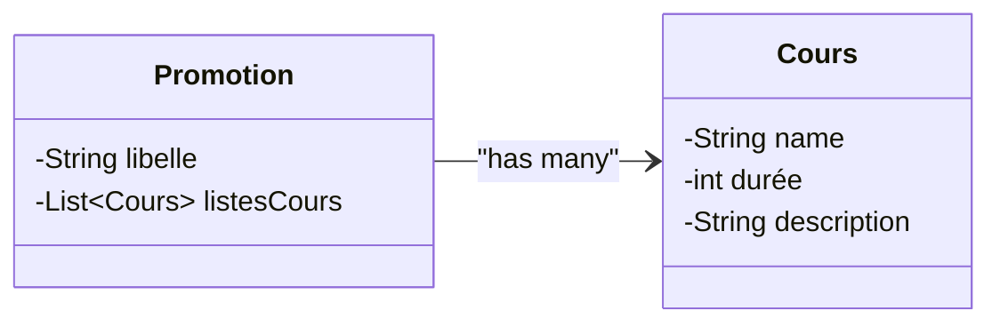

+++
title = "TP2 JPA Mapping"
weight = 50
+++

> [!ressource] Ressources
> - https://github.com/Adrien-Courses/R605-TP-JPA-Mapping

## 1. Télécharger et lancer le projet
- Lancer Docker Desktop
- Télécharger et [importer le projet Maven dans Eclipse]()

Lancer l'image docker présente dans le `Dockerfile` : `docker compose up`

## 2. Consignes

> [!affirmation] Objectif
> D'approfondir la relation `@OneToMany` et de comprendre la notion de relation unidirectionnelle et bidirectionnelle.


### a) Créer les entités
Une `Promotion` est composée de `Cours`. Écrire les entités JPA pour représenter cette relation unidirectionnelle
- Attention, dans cette première itération nous voulons 3 tables



```
+------------------------+
| Tables_in_training-jpa |
+------------------------+
| Cours                  |
| Promotion              |
| Promotion_Cours        |
+------------------------+
```

Nous pouvons également inspecter cette table de jointure via la commande `DESCRIBE Promotion_Cours;`
```
+----------------+--------+------+-----+---------+-------+
| Field          | Type   | Null | Key | Default | Extra |
+----------------+--------+------+-----+---------+-------+
| Promotion_id   | bigint | NO   | MUL | NULL    |       |
| listesCours_id | bigint | NO   | PRI | NULL    |       |
+----------------+--------+------+-----+---------+-------+
```

### b) Insérer des données
Insérer des données (sans utiliser l'attribut `cascade`)
- Une promotion INFO3
- Et deux cours

### c) Améliorer le code pour persister une seule fois

Modifier votre code, pour ne plus avoir besoin de persister à la fois les cours et la promotion

### d) Deux relations unidirectionnelles
Nous souhaitons pouvoir naviguer dans les deux sens, adapter le code pour créer deux relations unidirectionnelles 
- nous en profiterons pour renommer la table de jointure en `tj_promotion_cours` et les colonnes en `promotion_fk` et `cours_fk`

<!--
@Entity
public class Promotion {
    ...

    @OneToMany(cascade = CascadeType.ALL)
    @JoinTable(
        name = "tj_promotion_cours", // Nom de la table de jointure
        joinColumns = @JoinColumn(name = "promotion_fk"), // Colonne FK pour Promotion
        inverseJoinColumns = @JoinColumn(name = "cours_fk") // Colonne FK pour Cours
    )
    private List<Cours> listesCours;
}

joinColumns est le owning side, la classe où on rajoute cette annotation ici Promotion
-->

```
mysql> DESCRIBE tj_promotion_cours;
+----------------+--------+------+-----+---------+-------+
| Field          | Type   | Null | Key | Default | Extra |
+----------------+--------+------+-----+---------+-------+
| promotion_fk   | bigint | NO   | MUL | NULL    |       |
| cours_fk       | bigint | NO   | PRI | NULL    |       |
+----------------+--------+------+-----+---------+-------+
```

### e) Éviter la table de jointure
Par défaut l'outil JPA génère une table de jointure pour une relation 1 vers N unidirectionnelle . Mais nous pouvons facilement utiliser le principe des clés étrangères.
- Adapter le code pour avoir une relation bidirectionnelle 

```
mysql> SHOW TABLES;
+------------------------+
| Tables_in_training-jpa |
+------------------------+
| Cours                  |
| Promotion              |
+------------------------+
```

Faire attention à ce que la colonne `promotion_id` (FK) ne soit pas `NULL`

```
mysql> SELECT * FROM Cours;
+-------+----+--------------+----------------------------------------+-------------------------+
| duree | id | promotion_id | description                            | name                    |
+-------+----+--------------+----------------------------------------+-------------------------+
|    40 |  1 |            1 | Programmation Java avanc�e             | Java                    |
|    45 |  2 |            1 | Principes de l'architecture logicielle | Architecture Logicielle |
|   130 |  3 |            1 | UML Design                             | UML                     |
+-------+----+--------------+----------------------------------------+-------------------------+
```

-- M'appeler