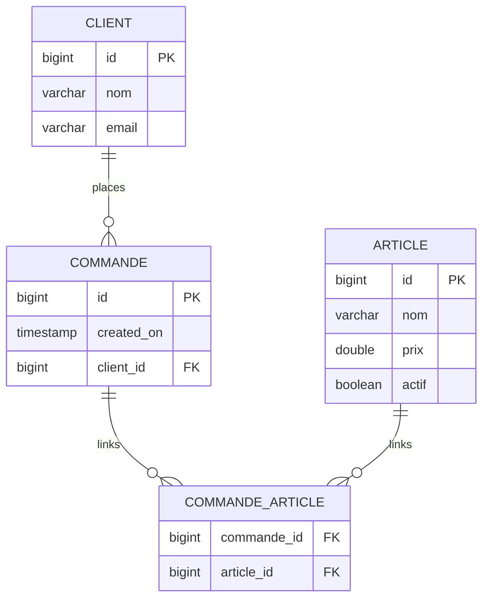

+++
title = "TP1 Spring JPA Découverte"
weight = 10
+++

> [!Ressource] Ressource
> - https://github.com/Adrien-Courses/R601-TP-SPRINGJPA-Decouverte/tree/main

## 1. Télécharger et lancer le projet
- Lancer Docker Desktop
- Télécharger et [importer le projet Maven dans Eclipse]()

Lancer l'image docker présente dans le `Dockerfile` : `docker compose up`

> [!definition] Lancer une fois 
> 1. Lancer la méthode JpaSpringEnterpriseArchitectureApplication.main() une première fois
> 2. Ceci va insérer des données dans la table `Article` et `Client`
> 3. Dans `application.properties` modifier `spring.sql.init.mode=always` en `spring.sql.init.mode=never`

## 2. Consignes
> [!affirmation] Objectif
> Apprendre à utiliser les fonctionnalités de base de Spring Data JPA

- Le code est donné pour l'ensemble des entités JPA
  - l'entité Article qui est dans plusieurs commandes
  - l'entité Client qui a plusieurs commandes
  - l'entité Commande qui a plusieurs articles
  


- Les points d'entrées de notre application sont les Contrôleurs
  - `CommandeController` qui permet de récupérer / créer / supprimer une commande
  - Les autres Contrôleurs n'ont pas été codés

### Créer une commande
Complémenter les classes `*Service` et `*Repository` afin de pour créer une nouvelle commande
- Il faut que tous les articles soient actifs pour créer une commande

```
curl --request POST \
  --url http://localhost:4545/v1/commandes \
  --header 'content-type: application/json' \
  --data '{
  "clientId": 1,
  "articleIds": [
    4
  ]
}  '
```


### Récupérer toutes les commandes
Faire l'endpoint pour récupérer toutes les commandes
- on veut également avoir un attribut `total` qui montre le prix total de la commande

**=> Depuis postman ou votre navigateurs récupérer toutes les commandes**

#### Complément
Dans le `application.yml` ajoutez `spring.jpa.open-in-view=false`
- [What is this spring.jpa.open-in-view=true property in Spring Boot?](https://stackoverflow.com/questions/30549489/what-is-this-spring-jpa-open-in-view-true-property-in-spring-boot)
- [The Open Session In View Anti-Pattern](https://vladmihalcea.com/the-open-session-in-view-anti-pattern/)

Pour résoudre voir [Optimisation des lectures]()
<!--
Si dans le controlleur en désactivement le open-in-view

    @GetMapping
    public ResponseEntity<List<Commande>> getAllCommandes() {
    	List<Commande> commandes = commandeService.getAllCommandes();
    	return ResponseEntity.ok(commandes);
    }

bhè ca ne peut pas fonctionner car article et client ne sont pas laod lazy
-> il faudrait dans getallcommandes service puis repository soit entity graph soit join soir hibernate.initialize (cf jpa_deeper/fetch/)


@Query("SELECT DISTINCT c FROM Commande c "
    + "LEFT JOIN FETCH c.client "
    + "LEFT JOIN FETCH c.articles")
List<Commande> findAllWithClientAndArticles();

/!\ Qu'on retourne une commande ou un dto on aura l'erreur car dans le toResponseModel on va chercher le client

CONTROLLER
public List<Commande> getAllCommandesLazy() {
    List<Commande> commandes = commandeRepository.findAll();
    return commandes;
}

public List<Commande> getAllCommandes() {
    List<Commande> commandes = commandeRepository.findAllWithClientAndArticles();
    return commandes;
}

private List<CommandeResponseModel> toResponseModel(List<Commande> commandes) {
    List<CommandeResponseModel> commandeResponseModels = new ArrayList<CommandeResponseModel>();
    for(Commande commande : commandes) {
        CommandeResponseModel commandeResponseModel = new CommandeResponseModel(commande);
        commandeResponseModels.add(commandeResponseModel);

    }
    return commandeResponseModels;
}


SERVICE
public List<Commande> getAllCommandesLazy() {
    List<Commande> commandes = commandeRepository.findAll();
    return commandes;
}

public List<Commande> getAllCommandes() {
    List<Commande> commandes = commandeRepository.findAllWithClientAndArticles();
    return commandes;
}

-->